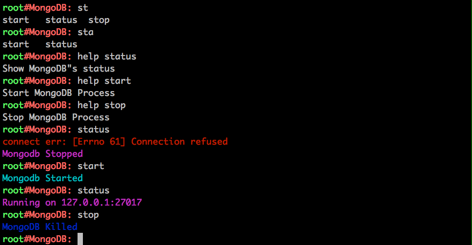

## 功能：
1. 可以自定义Shell的提示符以及输出颜色
2. 支持命令的自动补全
3. 支持对MongoDB的启动/关闭/查看状态(是否启动)
4. 输出帮助信息，以及子命令的帮助信息
5. 添加命令可扩展性

## 执行

```
ipython -i main.py or python main.py
```

## 功能

- [x] command通过插件的方式添加新命令
- [x] Tab补全
- [x] 帮助信息
- [x] 通过socket查看进程状态
- [x] 通过signal kill进程
- [x] 通过subprocess执行启动命令

## 使用

- help 查看全部的命令列表

- help status/start/stop 查看具体命令的帮助信息

- start 启动MongoDB

- stop 关闭MongoDB

- status 查看MongoDB状态





## MongoDB的参数

```
mongod -h 查看帮助信息,主要需要一下的参数：
--bind_ip_all
--pidfilepath arg 找该文件杀进程
--fork deamon
```